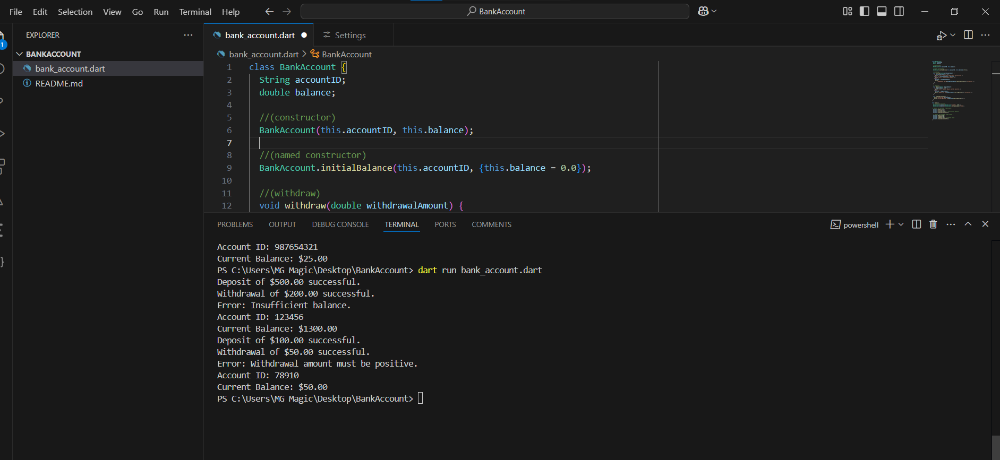

# BankAccount-Dart

This project demonstrates a simple `BankAccount` class in Dart with functionalities to deposit, withdraw, and display account information.

## Features
- **Two constructors**: One for initializing both account ID and balance, and a named constructor for initializing account ID only with a default balance of 0.
- **Deposit method**: Adds a specified amount to the account balance.
- **Withdraw method**: Deducts a specified amount if the balance is sufficient; otherwise, it displays an error.
- **Display method**: Shows the account ID and current balance.

## Example Usage
1. Create accounts using both constructors.
2. Perform deposit and withdrawal operations, including edge cases like insufficient balance or invalid inputs.

## Output Screenshot

